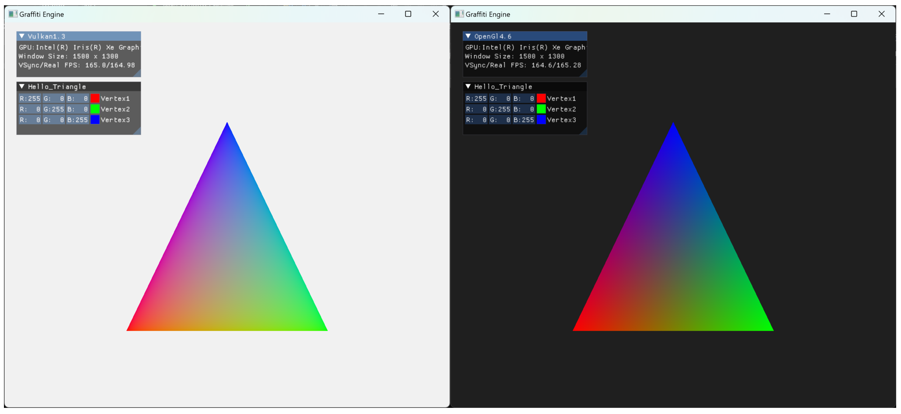
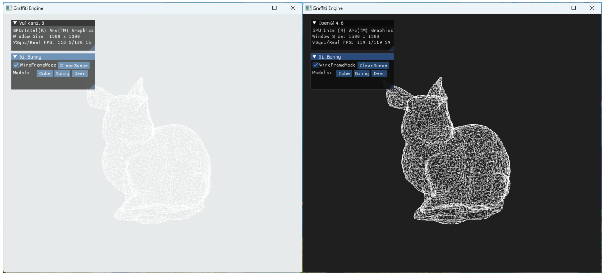
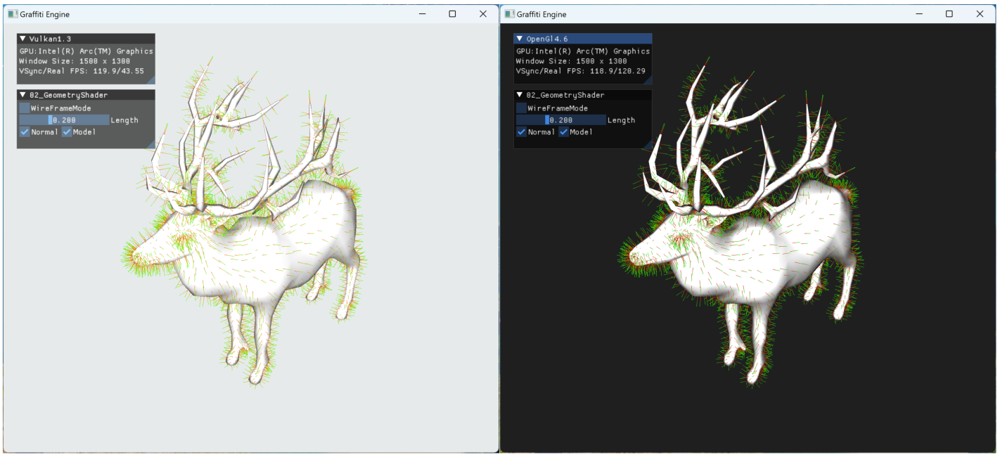
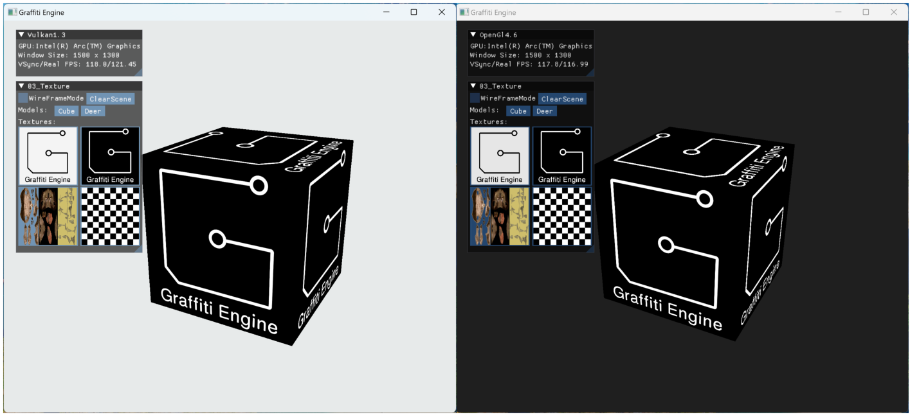

# Graffiti Engine

[](https://github.com/htl309/Graffiti )[](https://gitee.com/htl309/Graffiti)


### API and Platforms

- [x] Support OpenGL API
- [ ] Support Vulkan API
- [ ] Support Windows OS
- [ ] Support Android OS

### Graphics Algorithms

- [x] Triangle						       2025.6.4
- [x] WireframeMode                2025.6.10
- [x] Camera                               2025.6.10
- [x] Blinn-Phong Lighting        2025.6.13
- [x] Geometry Shader              2025.6.18
- [x] Texture                                2025.7.1
- [ ] Materials and PBR
- [ ] Shadows
- [ ] Deferred Rendering
- [ ] Mesh Shader
- [ ] PCB Hybrid Pipeline

### Environment

- GLAD   4.6  (OpenGL API)
- Vulkan 1.3  (Vulkan API)
- GLFW          (Windows)
- glm           （math、math,、math)
- ImGui         (UI interaction)
- spdlog        (logging system)
- stb              (texture loading)
- tinygltf       (model loading)

### Build

1. Use CMake on Windows to build the project. Everything needed should already be included, so you can build and run the project directly.
2. Note that you must build the CMake `build` folder created in the root directory, because some paths in my CMake files are hardcoded to `build`.
3. Of course, the Graffiti engine core itself does not require the second step’s build folder setup — you can compile it directly to get `Graffiti.lib`, which can be used by other programs.

### Notes

- Some algorithms use architectures not supported on Android; we will address that later.

- Code line count: In the project root directory terminal on Windows, run the following command to see the code line count. Currently, it should be around 7,000 lines.

  ```powershell
  Get-ChildItem "Graffiti" -Recurse -File -Include *.cpp,*.h,*.hpp | Get-Content | Measure-Object -Line
  ```

### Preview









