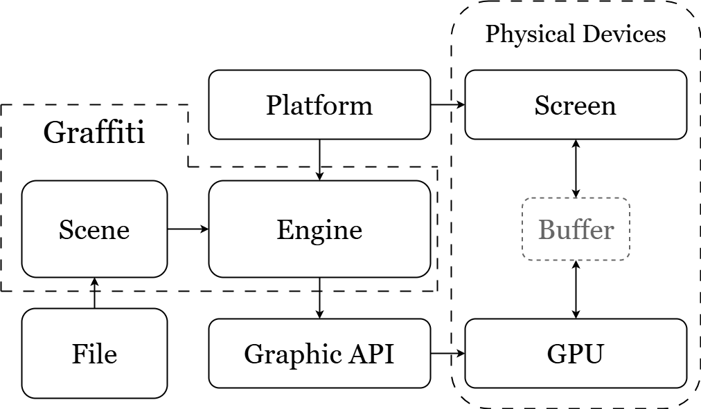

# Graffiti-Enigne Guide01 

- 2025/6/3

- 终于完成了Vulkan和OpenGl的跨API框架的搭建，打算写一个文档记录一下。
- 准备先在这个文档记录和介绍一部分内容，比如：这个底层框架的基本架构和设计思想等等。

**如上是基本框架总览：**

- File是文件，包括模型文件(obj/glft)、Shader文件、纹理照片.
- Platform是Windows、Android等系统的抽象，负责提供窗口。
- Graphic API是图形API的统称，我只打算集成Vulkan和OpenGL4.6。
- 屏幕和GPU自然不必多说。
- 我要完成的是Graffiti部分的设计与实现，其中包括Scene和Engine两部分：
  - Scene：包含诸多场景信息，包括但不限于场景中的相机，光照，我需要用到的纹理贴图以及模型(网格与材质)。场景还需要有一些读取文件的接口，比如o模型文件和各种的Shader代码。最后打包整理成一个数据结构提交给Engine进行渲染。
  - Engine：负责API和系统的抽象，比如Draw命令，应该就有Vulkan和OpenGL两种不同实现，包括创建管线，GUI窗口、事件响应，上传矩阵到显存中等等一系列操作，都有对应的API的不同实现。

**进度**：已经完成了Engine的基本设计了，可以用OpenGL和Vulkan画出同一个三角形了。下一步就要集成ImGui，以及上传矩阵。
