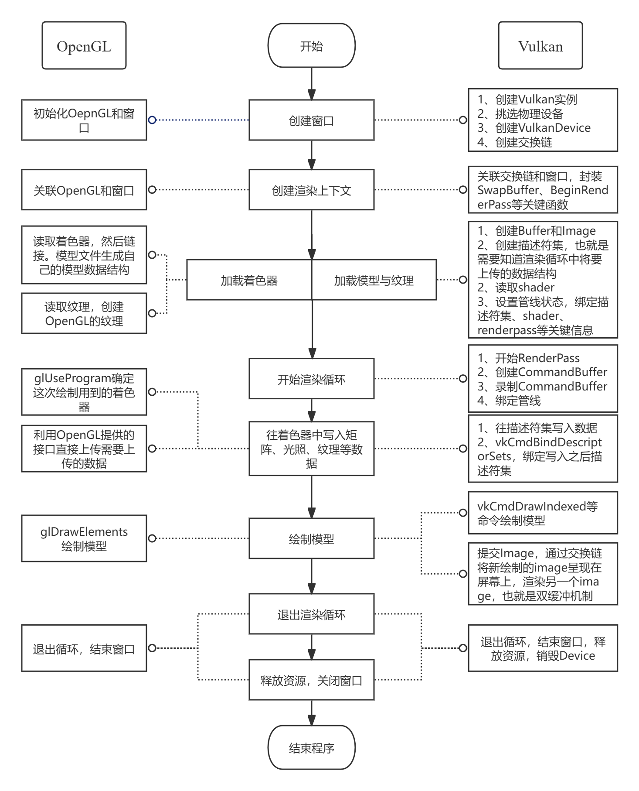

# Graffiti-Enigne Guide02 

- 2025/7/14
- 下图是大致的架构
- 封装渲染API的时候需要预想好整个渲染流程中所需要的东西，比如加载着色器和上传纹理等等，并且根据这些需要的功能定义一系列的函数。然后用OpenGL和Vulkan两种方式去实现这些接口。这样子就封装好了。
- 需要注意的有两点：
  - 需要尽可能考虑好所有的情况然后开始封装，封装的接口要灵活，并且可扩展，不然就会陷入到一次次重构的地步。当然也不能过于啰嗦，不然使用难度过大。
  - 最好能对商业引擎的封装有些了解，因为你并不知道优秀的接口设计是怎么样的。我的封装就不太过关，比如经常出现一个函数中的几个参数，无法被OpenGL和Vulkan同时使用。比如上传纹理，OpenGL需要指定纹理的名字，而Vulkan需要指定set和binding。也就是说上传纹理的函数中就至少会有三个参数，名字,set,binding。而OpenGL无需后面两个参数，导致参数冗余。

